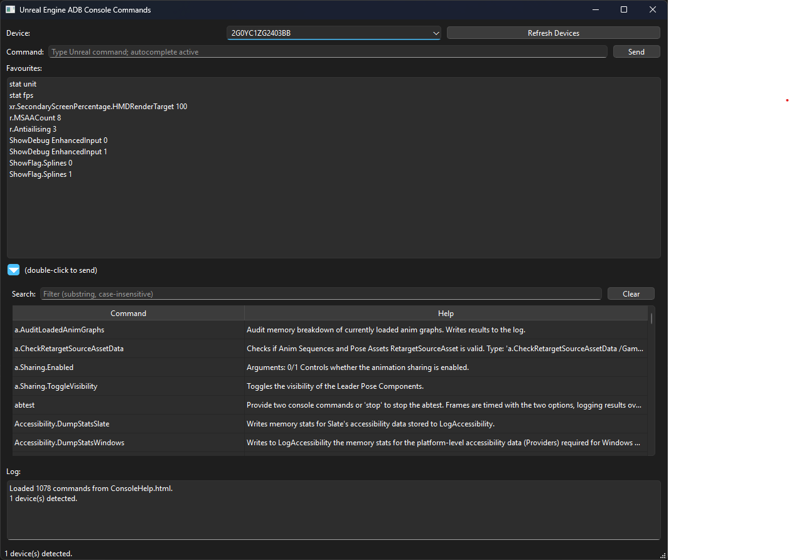

# Unreal Commands to Headset (PySide6 + ADB)

PySide6 desktop application for sending Unreal Engine console commands to an Android headset/device over ADB using the `adbutils` Python library (no raw subprocess juggling).



**Features**
- Device picker with auto-refresh and status updates
- Favourites list (double-click to send instantly)
- Manual command box with autocomplete fed by Unreal’s console catalog
- Collapsible “All Commands” table that shows command plus help text; double-click copies the command into the input for editing
- Log window for ADB responses and error messages

## Project Layout
```
README.md
requirements.txt
favourites.txt          # User-editable favourites list
src/
	__init__.py
	main.py              # PySide6 entry point
	adb_client.py
	commands_loader.py
```

## Prerequisites
- Windows with Python **3.10** (the app relies on that runtime; install via `py -3.10` or the Windows Store build).
- Ability to create/activate a virtual environment (instructions below use `.venv`).
- Android Platform Tools installed and `adb` on your PATH so `adbutils` can talk to the local server.
- Headset/device connected & authorized (`adb devices` should show `device`).
- Unreal application that listens for the broadcast `android.intent.action.RUN` with string extra key `cmd`.

## Quick Start (Users)
```powershell
# 1. Clone repo, then from the repo root:
py -3.10 -m venv .venv
.\.venv\Scripts\Activate.ps1
pip install --upgrade pip
pip install -r requirements.txt

# 2. Run the UI:
python -m src.main
```

Keep the PowerShell session open so the virtual environment stays active while you use the tool.

## Developer Setup
```powershell
# Create the venv once (Python 3.10)
py -3.10 -m venv .venv

# Activate whenever you work on the project
.\.venv\Scripts\Activate.ps1

# Install requirements / add new ones
pip install -r requirements.txt

# Run the app during development
python -m src.main

# After adding a dependency
pip freeze > requirements.txt
```

VS Code users can also select the provided `.vscode/launch.json` configuration "Run Unreal Commands UI" to launch via the debugger.

## ConsoleHelp.html (Command Catalog)
Unreal can export its complete list of console commands—including any that your project registers—by selecting **Help ▸ Console Variables** in the editor’s top menu. That action writes `ConsoleHelp.html` into your Unreal project at `Saved/ConsoleHelp.html`.

Workflow for this tool:
1. Generate the file inside Unreal as described above.
2. Copy the freshly generated `ConsoleHelp.html` into this repo’s root, replacing the sample file included for convenience.
3. Start (or restart) the UI. On launch it parses the HTML and updates autocomplete plus the “All Commands” table automatically.

Because Unreal includes user-defined commands in that HTML, sharing the file is safe and ensures teammates have the same catalog.

## Configure Favourite Commands
Edit `favourites.txt` to control the buttons that appear in the favourites list. Each non-empty, non-comment line is sent verbatim. Example contents:

```
# Default favourites
stat unit
stat fps
r.MSAACount 4
r.MSAACount 8
r.Antiailising 3
```

The file ships with the tool and is loaded at startup, so restart the app after editing to pick up changes.

## Sending Logic
Each command is delivered as an Android broadcast:
```bash
am broadcast -a android.intent.action.RUN -e cmd '<command>'
```
Executed via `adbutils` device shell, avoiding manual quoting pitfalls.

## Expanding Command List
To refresh the autocomplete / full list, regenerate `ConsoleHelp.html` via Unreal's `Help` command (UE saves it under `Saved/ConsoleHelp.html`). The app reads the file directly on launch, so dropping in a new export is enough.

## Autocomplete & Full Command Catalog
The UI parses the live exported HTML (`ConsoleHelp.html`) generated by UE's `Help` console command. It extracts all entries from the JavaScript array `var cvars = [...]` and:
- Populates an internal list for autocomplete (type substring in the Command field).
- Provides a collapsible table that shows command + help text; double-click copies only the command into the input so you can append parameters before sending.
- Includes a filter box for substring searches across both command names and help text.

If the HTML file is moved or renamed, adjust the default path logic in `commands_loader.py` or supply an absolute path by editing the loader.

Fail cases (file missing or parse error) will silently fall back to favourites only.

## Troubleshooting
- No devices: Ensure the headset shows under `adb devices` and is authorized.
- Broadcast not acted upon: Verify your Unreal app's receiver intent/action and extra key match (`cmd`).
- Slow responses: Keep the device awake; some shells stall when the device is in sleep state.
- Import errors: Confirm you activated the venv before running the script.

## Next Steps (Planned)
- Persist favourites with add/remove from the UI.
- Optional configurable path picker for `ConsoleHelp.html`.
- Command tagging/grouping for faster filtering.
- Quick latency/round-trip measurement per send.

---
Generated requirements recorded in `requirements.txt`; pin updates with `pip install --upgrade <pkg>; pip freeze > requirements.txt` as needed.
